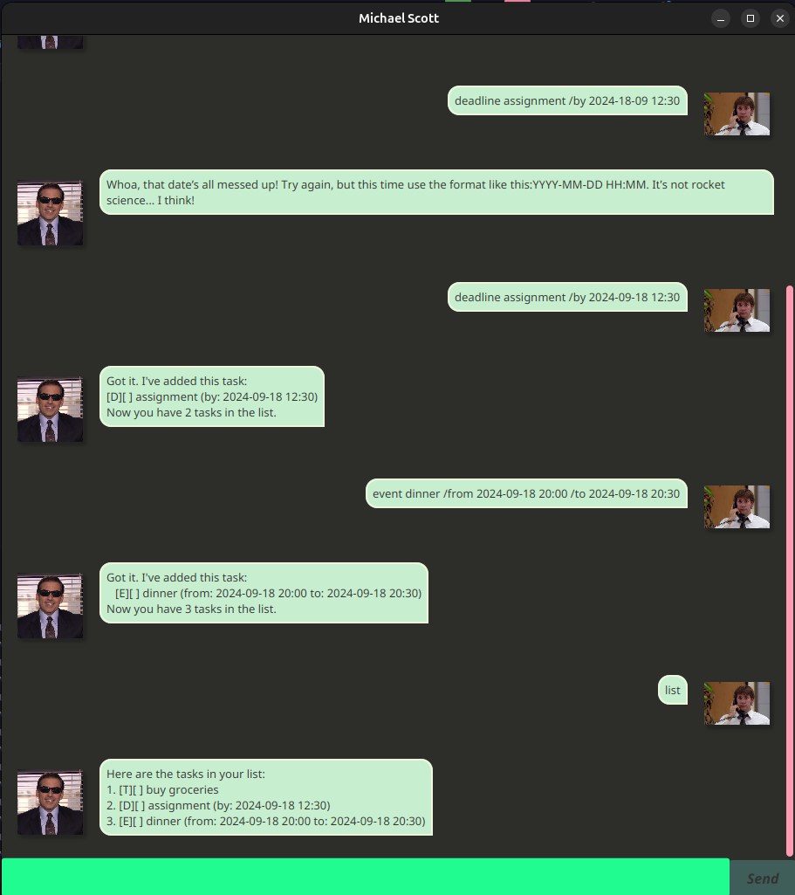

# Michael Scott user Guide




Michael Scott is the boss you needed at your home workplace so that he can motivate you to finish your todo-lists!

# Feature Description

## List all tasks: `list`
This command will list all the tasks added so far.

Example: `list`

```
Here are the tasks in your list: 
1. [T][] buy groceries
2. [D][] assignment(by:2024-08-18 12:30)
3. [E][] dinner (from 2024-09-18 20:00 to: 2024-09-18 20:30)
```

## Adding Todos : `todo`
This command will add a todo task to the list

Example: `todo buy groceries`

The todo entry will be added to the list and this message will be displayed
```
Got it. I've added this task: 
[T][] buy groceries
Now you have x tasks in the list
```
## Adding Events : `event`
This command will add an event task to the list


Example: `event dinner /from 2024-09-18 20:00 /to 2024-09-18 20:30`

The event entry gets added to the list and the following message is displayed
```
Got it. I've added this task: 
[E][] dinner (from 2024-09-18 20:00 to: 2024-09-18 20:30)
Now you have x tasks in the list
```
## Adding Deadlines : `deadline`
This command will a deadline task to the list

Example: `deadline assignment /by 2024-08-18 12:30`

The deadline entry gets added to the list and the following message is displayed

```
Got it. I've added this task: 
[D][] assignment (by: 2024-08-18 20:00)
Now you have x tasks in the list
```
## Adding tasks within periods: `Period`
This command will add a task that is to be done within a period

Example: `period collect certificate /start 2024-08-25 /end 2024-08-25`

The task will be added to the list and the following message will be displayed
```
Got it. I've added this task:
    [P][] collect certificate (from: 2024-08-25 to: 2024-08-25)
Now you have x tasks in the list
```
## Deleting task : `delete` 
Deletes a task from the todo list

Example: `delete 1`

```
Not finished? You miss 100% of the shots you don't take. Or finish. 
[E][] dinner (from: 2024-09-18 20:00 to: 2024-09-18 20:30)
Now you have 5 tasks in the list. 
```

## Clear your list: `clear`
Clears the entire to-do list

Example: `clear`

```
You know what? Forget about it. It's gone. Just like I forgot about Toby.
```
## Mark a task as done: `mark`
Marks a task as done. 

Example: `mark 1`

```
Nice! I've marked this task as done:
[T][X] assignment
now go back to work and stop eating the company's time
```
## Unmark a task: `unmark`
Unmarks a task to indicate not-done. 


Example: `unmark 1`

```
OK, I've marked this task as not done yet:
[T][] stuff
```
## Exit application: `bye`
Exits the application and closes the window


Example: `bye`

```
The window closes and application exits
```
